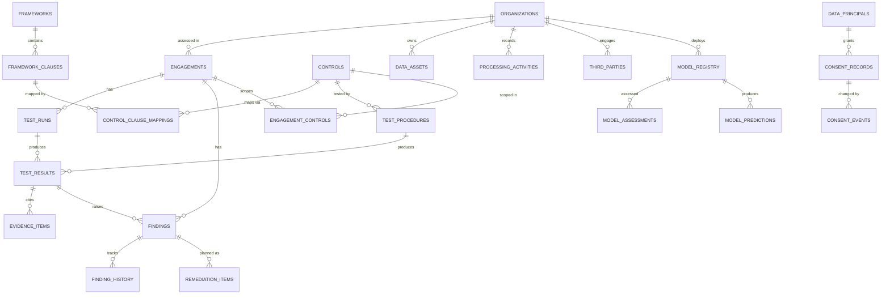

# AssureLens — Backend Schema

| | |
|---|---|
| Version | 1.0 |
| Date | 21 September 2026 |
| Database | PostgreSQL 16 · SQLAlchemy 2.x · Alembic |
| Status | Approved for build |
| Related | [TRD.md](TRD.md) · [PRD.md](PRD.md) |

---

## 1. Design principles

| # | Principle | Consequence |
|---|---|---|
| D1 | **Results are immutable** | `test_results` is append-only. A re-test writes a new row. History is the audit trail, not a changelog. |
| D2 | **Statistics live with the verdict** | `n`, `N`, coverage, CI bounds and the thresholds applied are columns on `test_results`, not recomputed later. A conclusion must be reproducible from its own row. |
| D3 | **Gate reasons are structured** | `gate_reasons` is an array of enum codes, not prose, so they can be counted, filtered and rendered consistently. |
| D4 | **Evidence is hashed and timestamped** | The workpaper asserts evidence unchanged since conclusion. |
| D5 | **Controls are seeded from YAML** | The library is versioned in git; the DB is a projection. [TRD ADR-008] |
| D6 | **Synthetic estate is separated** | Meridian's fake customers/models/vendors live in their own tables, clearly named, never mixed with assessment data. |
| D7 | **Auth-ready, auth-free** | `users`/`roles` exist and are referenced; v1 writes a synthetic demo actor. No rework needed later. [TRD §9] |
| D8 | **Append-only audit log** | The assurance tool must itself be auditable. [PRD P4] |

---

## 2. Entity overview



---

## 3. DDL

### 3.1 Enums

```sql
CREATE TYPE verdict_t AS ENUM
  ('PASS','FAIL','INSUFFICIENT_EVIDENCE','NOT_APPLICABLE');

-- Gate rule codes. Structured, never prose. [D3, PRD §6.3]
CREATE TYPE gate_reason_t AS ENUM
  ('G1_MIN_SAMPLE','G2_CI_WIDTH','G3_COVERAGE','G4_MISSING_ARTIFACT',
   'G5_STALE_EVIDENCE','G6_NON_REPRESENTATIVE','G7_SOURCE_UNVERIFIED',
   'G8_TARGET_UNREACHABLE');

CREATE TYPE severity_t       AS ENUM ('CRITICAL','HIGH','MEDIUM','LOW');
CREATE TYPE finding_status_t AS ENUM
  ('OPEN','IN_REMEDIATION','RETEST_PENDING','CLOSED','ACCEPTED_RISK');
CREATE TYPE evidence_kind_t  AS ENUM
  ('DB_QUERY','HTTP_PROBE','FILE_ARTIFACT','ATTESTATION');
CREATE TYPE inference_mode_t AS ENUM ('POPULATION','CENSUS');
CREATE TYPE run_status_t     AS ENUM ('QUEUED','RUNNING','COMPLETE','FAILED');
CREATE TYPE source_status_t  AS ENUM ('VERIFIED','UNVERIFIED');
CREATE TYPE control_domain_t AS ENUM
  ('NOTICE_CONSENT','SECURITY_SAFEGUARDS','RETENTION_ERASURE',
   'PRINCIPAL_RIGHTS','THIRD_PARTY_TRANSFER','AI_GOVERNANCE',
   'BREACH_RESPONSE','GOVERNANCE_ACCOUNTABILITY');
CREATE TYPE role_t           AS ENUM ('CONSULTANT','CLIENT','REVIEWER');
```

`inference_mode_t` is what lets probe suites (census — the probe set *is* the population) skip G1/G2/G3 while record-sampling suites do not. [TRD §4.3]

### 3.2 Control library

```sql
CREATE TABLE frameworks (
    id            SMALLSERIAL PRIMARY KEY,
    code          TEXT NOT NULL UNIQUE,      -- 'DPDP','ISO27001','NIST_AI_RMF'
    name          TEXT NOT NULL,
    version       TEXT NOT NULL,             -- 'Rules 2025','2022','1.0'
    authority     TEXT,                      -- 'MeitY, G.S.R. 846(E)'
    source_url    TEXT
);

CREATE TABLE framework_clauses (
    id            SERIAL PRIMARY KEY,
    framework_id  SMALLINT NOT NULL REFERENCES frameworks(id) ON DELETE CASCADE,
    ref           TEXT NOT NULL,             -- 'R6(1)(b)', 'A.5.15', 'MEASURE 2.11'
    title         TEXT NOT NULL,
    -- Verbatim statutory text, rendered by ClauseQuote in the UI. [UX §4.3]
    verbatim_text TEXT,
    in_force_from DATE,                      -- Rule 1 commencement [SOURCES A1.1]
    source_status source_status_t NOT NULL DEFAULT 'VERIFIED',
    source_note   TEXT,                      -- SOURCES open-item ref if unverified
    UNIQUE (framework_id, ref)
);

CREATE TABLE controls (
    id              SERIAL PRIMARY KEY,
    ref             TEXT NOT NULL UNIQUE,    -- 'DPDP-06-02'
    title           TEXT NOT NULL,
    objective       TEXT NOT NULL,
    domain          control_domain_t NOT NULL,
    procedure_text  TEXT NOT NULL,           -- human-readable, printed in workpaper
    inference_mode  inference_mode_t NOT NULL DEFAULT 'POPULATION',
    is_executable   BOOLEAN NOT NULL DEFAULT FALSE,
    auto_raise      BOOLEAN NOT NULL DEFAULT TRUE,
    -- Per-control threshold overrides. NULL => engine default.
    -- Every non-null value is printed in the workpaper threshold register.
    threshold_overrides JSONB NOT NULL DEFAULT '{}',
    yaml_source     TEXT NOT NULL,           -- provenance: controls/dpdp.yaml
    created_at      TIMESTAMPTZ NOT NULL DEFAULT now()
);

CREATE TABLE control_clause_mappings (
    control_id  INTEGER NOT NULL REFERENCES controls(id) ON DELETE CASCADE,
    clause_id   INTEGER NOT NULL REFERENCES framework_clauses(id) ON DELETE CASCADE,
    is_primary  BOOLEAN NOT NULL DEFAULT FALSE,   -- exactly one primary per control
    rationale   TEXT,
    PRIMARY KEY (control_id, clause_id)
);

-- Exactly one primary clause per control: the control's legal basis.
CREATE UNIQUE INDEX ux_control_primary_clause
    ON control_clause_mappings (control_id) WHERE is_primary;

CREATE TABLE test_procedures (
    id              SERIAL PRIMARY KEY,
    control_id      INTEGER NOT NULL REFERENCES controls(id) ON DELETE CASCADE,
    plugin_key      TEXT NOT NULL,   -- '@register' key, e.g. 'consent.withdrawal_propagation'
    suite           TEXT NOT NULL,   -- 'pii_retention','consent','access_probes',
                                     -- 'third_party','ai_assurance'
    config          JSONB NOT NULL DEFAULT '{}',
    evidence_contract JSONB NOT NULL, -- required items, population_source, max_age_days
    UNIQUE (control_id, plugin_key)
);
```

### 3.3 Engagements

```sql
CREATE TABLE organizations (
    id            SERIAL PRIMARY KEY,
    name          TEXT NOT NULL,
    sector        TEXT,
    city          TEXT,
    headcount     INTEGER,
    is_significant_data_fiduciary BOOLEAN NOT NULL DEFAULT FALSE,  -- drives Rule 13
    is_synthetic  BOOLEAN NOT NULL DEFAULT TRUE,   -- D6; UI disclosure depends on it
    notes         TEXT
);

CREATE TABLE users (
    id       SERIAL PRIMARY KEY,
    email    TEXT UNIQUE,
    name     TEXT NOT NULL,
    role     role_t NOT NULL,
    org_id   INTEGER REFERENCES organizations(id),
    is_demo_actor BOOLEAN NOT NULL DEFAULT FALSE   -- v1 writes this actor [D7]
);

CREATE TABLE engagements (
    id             SERIAL PRIMARY KEY,
    org_id         INTEGER NOT NULL REFERENCES organizations(id) ON DELETE CASCADE,
    name           TEXT NOT NULL,
    scope_note     TEXT,
    period_start   DATE,
    period_end     DATE,
    compliance_deadline DATE,     -- 2027-05-13 for Meridian [SOURCES A1.1]
    created_at     TIMESTAMPTZ NOT NULL DEFAULT now()
);

CREATE TABLE engagement_controls (
    engagement_id  INTEGER NOT NULL REFERENCES engagements(id) ON DELETE CASCADE,
    control_id     INTEGER NOT NULL REFERENCES controls(id) ON DELETE CASCADE,
    in_scope       BOOLEAN NOT NULL DEFAULT TRUE,
    na_reason      TEXT,          -- required when in_scope = FALSE
    evidence_owner TEXT,          -- printed in the gate block [UX §6.2]
    PRIMARY KEY (engagement_id, control_id),
    CONSTRAINT ck_na_reason CHECK (in_scope OR na_reason IS NOT NULL)
);
```

That final constraint enforces a small but real discipline: **you cannot scope a control out without writing down why.** Unexplained exclusions are how assurance scope quietly shrinks to what passes.

### 3.4 Runs, results, evidence — the core

```sql
CREATE TABLE test_runs (
    id            SERIAL PRIMARY KEY,
    engagement_id INTEGER NOT NULL REFERENCES engagements(id) ON DELETE CASCADE,
    seed          BIGINT NOT NULL,            -- reproducibility [TRD §3.4]
    suites        TEXT[] NOT NULL,
    status        run_status_t NOT NULL DEFAULT 'QUEUED',
    started_at    TIMESTAMPTZ NOT NULL DEFAULT now(),
    completed_at  TIMESTAMPTZ,
    engine_version TEXT NOT NULL,
    error         TEXT
);

-- APPEND-ONLY. Never updated, never deleted. [D1]
CREATE TABLE test_results (
    id             BIGSERIAL PRIMARY KEY,
    run_id         INTEGER NOT NULL REFERENCES test_runs(id) ON DELETE CASCADE,
    control_id     INTEGER NOT NULL REFERENCES controls(id),
    procedure_id   INTEGER REFERENCES test_procedures(id),

    verdict        verdict_t NOT NULL,
    raw_outcome    verdict_t,      -- pre-gate outcome; NULL if never computed.
                                   -- Keeping it makes gate overrides visible:
                                   -- "would have passed, but coverage was 0.5%"
    gate_fired     BOOLEAN NOT NULL DEFAULT FALSE,
    gate_reasons   gate_reason_t[] NOT NULL DEFAULT '{}',

    -- Statistics: carried with the verdict, not recomputed. [D2]
    sample_size     INTEGER,
    population_size BIGINT,
    successes       INTEGER,
    coverage_pct    NUMERIC(6,3),
    point_estimate  NUMERIC(6,5),
    ci_lower        NUMERIC(6,5),
    ci_upper        NUMERIC(6,5),
    ci_method       TEXT,          -- 'wilson_95'
    ci_width        NUMERIC(6,5) GENERATED ALWAYS AS (ci_upper - ci_lower) STORED,

    thresholds_applied JSONB NOT NULL DEFAULT '{}',
    threshold_overrides JSONB NOT NULL DEFAULT '{}',   -- printed in workpaper
    detail         JSONB NOT NULL DEFAULT '{}',        -- suite-specific payload
    duration_ms    INTEGER,
    run_at         TIMESTAMPTZ NOT NULL DEFAULT now(),

    CONSTRAINT ck_sample_le_population
        CHECK (population_size IS NULL OR sample_size IS NULL
               OR sample_size <= population_size),
    CONSTRAINT ck_successes_le_sample
        CHECK (sample_size IS NULL OR successes IS NULL
               OR successes <= sample_size),
    CONSTRAINT ck_gate_reasons_present
        CHECK (NOT gate_fired OR cardinality(gate_reasons) > 0),
    CONSTRAINT ck_insufficient_implies_gate
        CHECK (verdict <> 'INSUFFICIENT_EVIDENCE' OR gate_fired)
);
```

The last two constraints are the schema enforcing the product's thesis: **a verdict of `INSUFFICIENT_EVIDENCE` cannot exist without a recorded reason.** It is impossible, at the database level, to shrug.

```sql
CREATE TABLE evidence_items (
    id            BIGSERIAL PRIMARY KEY,
    result_id     BIGINT NOT NULL REFERENCES test_results(id) ON DELETE CASCADE,
    kind          evidence_kind_t NOT NULL,
    label         TEXT NOT NULL,
    source_ref    TEXT,          -- table+query, probe URL, filename
    payload       JSONB,         -- probe request/response, query result sample
    content_hash  TEXT NOT NULL, -- SHA-256 [D4]
    collected_at  TIMESTAMPTZ NOT NULL,
    age_days      INTEGER,
    is_sufficient BOOLEAN NOT NULL DEFAULT TRUE,
    insufficiency_note TEXT
);
```

### 3.5 Findings and remediation

```sql
CREATE TABLE findings (
    id            SERIAL PRIMARY KEY,
    ref           TEXT NOT NULL UNIQUE,          -- 'F-003'
    engagement_id INTEGER NOT NULL REFERENCES engagements(id) ON DELETE CASCADE,
    control_id    INTEGER NOT NULL REFERENCES controls(id),
    origin_result_id BIGINT REFERENCES test_results(id),

    title         TEXT NOT NULL,
    description   TEXT NOT NULL,
    root_cause    TEXT,
    recommendation TEXT,

    likelihood    SMALLINT NOT NULL CHECK (likelihood BETWEEN 1 AND 5),
    impact        SMALLINT NOT NULL CHECK (impact BETWEEN 1 AND 5),
    risk_score    SMALLINT GENERATED ALWAYS AS (likelihood * impact) STORED,
    severity      severity_t NOT NULL,           -- banded from risk_score

    owner         TEXT,
    effort_days   NUMERIC(5,1),
    status        finding_status_t NOT NULL DEFAULT 'OPEN',
    is_internal_note_only BOOLEAN NOT NULL DEFAULT FALSE,  -- hidden in client view
    created_at    TIMESTAMPTZ NOT NULL DEFAULT now(),
    updated_at    TIMESTAMPTZ NOT NULL DEFAULT now()
);

CREATE TABLE finding_history (
    id          BIGSERIAL PRIMARY KEY,
    finding_id  INTEGER NOT NULL REFERENCES findings(id) ON DELETE CASCADE,
    changed_at  TIMESTAMPTZ NOT NULL DEFAULT now(),
    actor_id    INTEGER REFERENCES users(id),
    field       TEXT NOT NULL,
    old_value   TEXT,
    new_value   TEXT
);

CREATE TABLE remediation_items (
    id            SERIAL PRIMARY KEY,
    finding_id    INTEGER NOT NULL REFERENCES findings(id) ON DELETE CASCADE,
    sequence      SMALLINT NOT NULL,
    action        TEXT NOT NULL,
    owner         TEXT,
    effort_days   NUMERIC(5,1),
    target_date   DATE,
    expected_residual_risk SMALLINT CHECK (expected_residual_risk BETWEEN 1 AND 25),
    UNIQUE (finding_id, sequence)
);
```

Severity bands from `risk_score` (1–25): `20–25 CRITICAL · 12–19 HIGH · 6–11 MEDIUM · 1–5 LOW`. Banding is applied in one place in application code and documented on screen, so a client can argue with the thresholds rather than with an opaque label.

### 3.6 The synthetic estate

Prefixed `est_` so it can never be mistaken for assessment data. [D6]

```sql
CREATE TABLE est_data_assets (
    id            SERIAL PRIMARY KEY,
    org_id        INTEGER NOT NULL REFERENCES organizations(id) ON DELETE CASCADE,
    name          TEXT NOT NULL,          -- 'crm_customers','call_transcripts'
    system        TEXT,
    classification TEXT,
    declared_identifier_classes TEXT[] NOT NULL DEFAULT '{}',  -- the inventory
    encryption_at_rest BOOLEAN NOT NULL DEFAULT FALSE,
    record_count  BIGINT,
    hosted_region TEXT                     -- Rule 15 relevance
);

CREATE TABLE est_processing_activities (
    id            SERIAL PRIMARY KEY,
    org_id        INTEGER NOT NULL REFERENCES organizations(id) ON DELETE CASCADE,
    purpose       TEXT NOT NULL,
    lawful_basis  TEXT NOT NULL,
    asset_id      INTEGER REFERENCES est_data_assets(id),
    retention_days INTEGER,               -- Third Schedule period
    log_retention_days INTEGER            -- Rule 8(3) minimum 365 — seeded at 90 (S6)
);

CREATE TABLE est_data_principals (
    id                    BIGSERIAL PRIMARY KEY,
    org_id                INTEGER NOT NULL REFERENCES organizations(id) ON DELETE CASCADE,
    external_ref          TEXT NOT NULL,
    last_contact_at       TIMESTAMPTZ,    -- drives Rule 8(1) erasure clock
    erased_at             TIMESTAMPTZ,
    legal_hold            BOOLEAN NOT NULL DEFAULT FALSE,
    pre_erasure_notice_at TIMESTAMPTZ,    -- Rule 8(2) 48-hour notice
    group_attribute       TEXT,           -- fairness grouping, suite 5
    is_minor              BOOLEAN NOT NULL DEFAULT FALSE
);

CREATE TABLE est_consent_records (
    id            BIGSERIAL PRIMARY KEY,
    principal_id  BIGINT NOT NULL REFERENCES est_data_principals(id) ON DELETE CASCADE,
    purpose       TEXT NOT NULL,
    status        TEXT NOT NULL,          -- 'ACTIVE','WITHDRAWN'
    granted_at    TIMESTAMPTZ NOT NULL,
    withdrawn_at  TIMESTAMPTZ,
    -- The S1 defect lives here: downstream lags the store.
    downstream_synced_at TIMESTAMPTZ,
    UNIQUE (principal_id, purpose)
);

CREATE TABLE est_consent_events (
    id            BIGSERIAL PRIMARY KEY,
    consent_id    BIGINT NOT NULL REFERENCES est_consent_records(id) ON DELETE CASCADE,
    event         TEXT NOT NULL,          -- 'GRANT','WITHDRAW','DOWNSTREAM_SYNC'
    occurred_at   TIMESTAMPTZ NOT NULL,
    latency_ms    BIGINT                  -- measured propagation, suite 2
);

CREATE TABLE est_third_parties (
    id            SERIAL PRIMARY KEY,
    org_id        INTEGER NOT NULL REFERENCES organizations(id) ON DELETE CASCADE,
    name          TEXT NOT NULL,
    category      TEXT,
    dpa_reference TEXT,                   -- NULL => finding (S4)
    granted_scopes TEXT[] NOT NULL DEFAULT '{}',
    exercised_scopes TEXT[] NOT NULL DEFAULT '{}',   -- proportionality check
    credential_issued_at TIMESTAMPTZ,
    last_used_at  TIMESTAMPTZ,            -- staleness check (S4)
    is_active     BOOLEAN NOT NULL DEFAULT TRUE,
    relationship_ended_at TIMESTAMPTZ,
    country       TEXT                    -- Rule 15
);

CREATE TABLE est_access_logs (
    id            BIGSERIAL PRIMARY KEY,
    org_id        INTEGER NOT NULL REFERENCES organizations(id) ON DELETE CASCADE,
    actor_ref     TEXT NOT NULL,
    asset_id      INTEGER REFERENCES est_data_assets(id),
    action        TEXT NOT NULL,
    occurred_at   TIMESTAMPTZ NOT NULL,
    was_authorised BOOLEAN
);

CREATE TABLE est_model_registry (
    id            SERIAL PRIMARY KEY,
    org_id        INTEGER NOT NULL REFERENCES organizations(id) ON DELETE CASCADE,
    name          TEXT NOT NULL,          -- 'MFS-CPS-v3'
    purpose       TEXT NOT NULL,
    deployed_at   TIMESTAMPTZ,
    training_snapshot JSONB,              -- per-feature bins, PSI baseline
    has_drift_monitoring BOOLEAN NOT NULL DEFAULT FALSE,   -- FALSE => S8
    is_consequential BOOLEAN NOT NULL DEFAULT TRUE         -- Rule 13(3)
);

CREATE TABLE est_model_predictions (
    id            BIGSERIAL PRIMARY KEY,
    model_id      INTEGER NOT NULL REFERENCES est_model_registry(id) ON DELETE CASCADE,
    principal_id  BIGINT REFERENCES est_data_principals(id),
    features      JSONB NOT NULL,
    score         NUMERIC(8,6),
    decision      TEXT,                   -- 'APPROVE','REFER','DECLINE'
    ground_truth  TEXT,                   -- equal-opportunity metric where present
    predicted_at  TIMESTAMPTZ NOT NULL
);

CREATE TABLE est_model_assessments (
    id            BIGSERIAL PRIMARY KEY,
    model_id      INTEGER NOT NULL REFERENCES est_model_registry(id) ON DELETE CASCADE,
    result_id     BIGINT REFERENCES test_results(id),
    metric        TEXT NOT NULL,          -- 'selection_rate_ratio','psi','null_rate'
    feature       TEXT,
    group_label   TEXT,
    value         NUMERIC(12,6),
    group_n       INTEGER,                -- MIN_GROUP_N gate for small groups
    assessed_at   TIMESTAMPTZ NOT NULL DEFAULT now()
);
```

### 3.7 Uploads and audit

```sql
CREATE TABLE uploads (
    id            UUID PRIMARY KEY DEFAULT gen_random_uuid(),
    engagement_id INTEGER REFERENCES engagements(id) ON DELETE CASCADE,
    filename      TEXT NOT NULL,
    row_count     INTEGER,
    profile       JSONB,                  -- per-column stats + detector hits
    column_mapping JSONB,
    uploaded_at   TIMESTAMPTZ NOT NULL DEFAULT now(),
    expires_at    TIMESTAMPTZ NOT NULL    -- 24h TTL, purge job [TRD §6]
);

-- APPEND-ONLY. No UPDATE or DELETE grant. [D8]
CREATE TABLE audit_log (
    id          BIGSERIAL PRIMARY KEY,
    occurred_at TIMESTAMPTZ NOT NULL DEFAULT now(),
    actor_id    INTEGER REFERENCES users(id),
    actor_role  role_t,
    action      TEXT NOT NULL,            -- 'RUN_STARTED','FINDING_EDITED',
                                          -- 'THRESHOLD_OVERRIDDEN','REPORT_EXPORTED'
    entity_type TEXT NOT NULL,
    entity_id   TEXT,
    detail      JSONB NOT NULL DEFAULT '{}'
);

REVOKE UPDATE, DELETE ON audit_log FROM PUBLIC;
```

`THRESHOLD_OVERRIDDEN` is logged deliberately. Loosening a gate to turn an `INSUFFICIENT_EVIDENCE` into a `PASS` is the one manoeuvre that would hollow out the product, so it is recorded in the audit log *and* printed in the workpaper. [PRD §6.3]

---

## 4. Indexes

```sql
CREATE INDEX ix_results_run          ON test_results (run_id);
CREATE INDEX ix_results_control_time ON test_results (control_id, run_at DESC);
CREATE INDEX ix_results_verdict      ON test_results (verdict);
CREATE INDEX ix_results_gate         ON test_results USING GIN (gate_reasons);
CREATE INDEX ix_evidence_result      ON evidence_items (result_id);
CREATE INDEX ix_findings_engagement  ON findings (engagement_id, status);
CREATE INDEX ix_findings_risk        ON findings (risk_score DESC);
CREATE INDEX ix_ctrl_map_clause      ON control_clause_mappings (clause_id);
CREATE INDEX ix_principals_erasure   ON est_data_principals (last_contact_at)
                                     WHERE erased_at IS NULL AND NOT legal_hold;
CREATE INDEX ix_consent_purpose      ON est_consent_records (purpose, status);
CREATE INDEX ix_predictions_model    ON est_model_predictions (model_id);
CREATE INDEX ix_audit_entity         ON audit_log (entity_type, entity_id, occurred_at DESC);
```

`ix_results_control_time` serves the control-detail history chart. `ix_principals_erasure` is a partial index matching suite 1b's exact predicate — the retention scan is the heaviest query in the product.

---

## 5. Seed plan — Meridian

Sized so the demo tells a clear story and the gate fires for real reasons, not contrived ones.

| Table | Rows | Why this number |
|---|---|---|
| `organizations` | 1 | Meridian, SDF = true |
| `users` | 3 | Aarti (consultant), Rohan (client), one reviewer |
| `engagements` | 1 | deadline `2027-05-13` [SOURCES A1.1] |
| `frameworks` | 3 | DPDP, ISO 27001, NIST AI RMF |
| `framework_clauses` | ~45 | 14 DPDP rules + ~20 ISO + ~11 NIST |
| `controls` | **25** | 12 executable, 13 documented-only [PRD §9.5] |
| `control_clause_mappings` | ~60 | avg 2.4 mappings/control |
| `est_data_assets` | 9 | incl. `call_transcripts` unencrypted (S9) |
| `est_processing_activities` | 12 | one with `log_retention_days = 90` (S6) |
| `est_data_principals` | **24,000** | 1% sample of the stated 2.4M; **11,400 past retention (S5)**, ~0 with pre-erasure notice |
| `est_consent_records` | 24,000 | 1 per principal; ~3,200 withdrawn |
| `est_consent_events` | ~31,000 | grants, withdrawals, lagged syncs (S1) |
| `est_third_parties` | **14** | 1 stale + no DPA (S4); 3 cross-border |
| `est_access_logs` | ~18,000 | incl. the gap that fails probe P-08 |
| `est_model_registry` | 1 | `MFS-CPS-v3`, `has_drift_monitoring = false` (S8) |
| `est_model_predictions` | **12,000** | 4 groups; smallest group **n = 22** — below `MIN_GROUP_N`, so it *gates* rather than reporting fake bias |
| `est_model_assessments` | populated per run | |
| `findings` | 0 at seed | **raised by the run, never seeded** |

> **Two sizing choices carry the argument.**
> **24,000 principals** makes coverage genuinely hard: a 200-record sample is 0.83%, well under `MIN_COVERAGE_PCT`, so G3 fires for a real statistical reason rather than a rigged one.
> **The 22-member group** is the fairness trap. A naive tool reports a dramatic disparity from 22 observations. AssureLens gates it and says the group is too small to conclude from — which is the correct, and far more impressive, answer.

Findings are never seeded. Every one in the demo is raised by a test that actually ran. [PRD §8.1]

---

## 6. Migrations

Alembic, one migration per logical change, `alembic upgrade head` on container start.

| Rev | Content |
|---|---|
| `0001` | Enums, control library, engagements |
| `0002` | Runs, results, evidence, constraints |
| `0003` | Findings, history, remediation |
| `0004` | Synthetic estate (`est_*`) |
| `0005` | Uploads, audit log, grant revocations |
| `0006` | Indexes |

Seeding is a separate idempotent command (`python -m app.seed.meridian --seed 42`), not a migration — so `/api/engagements/{id}/reset` can re-run it on the public demo without touching schema. [TRD §8]
